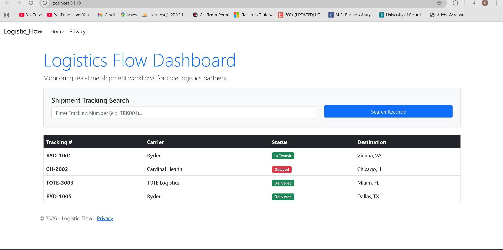

# LogisticsFlow Dashboard

I built this project to solve a common visibility problem in supply chain logistics. It’s a clean web app designed to track real-time delivery statuses for partners like Ryder and Cardinal Health.

### **Project Preview**

### **Key Features**

* **Status Tracking:** I used color-coded badges so anyone can instantly see what’s "In Transit," "Delivered," or "Delayed."
* **Search Functionality:** You can filter the tracking list by specific IDs (like RYD-1001) to find shipments instantly.
* **Industry Standards:** The data architecture is modeled after real 3PL (third-party logistics) workflows.

### **The Tech Stack**

* **Backend:** ASP.NET Core MVC & C#
* **Frontend:** Razor Pages & Bootstrap
* **Version Control:** Git Bash / GitHub

### **The Development Story**

This project represents a successful pivot from my usual Python-based work to the Microsoft tech stack. Beyond the coding, I managed the full environment setup, including .NET SDK configuration and handling terminal-based Git pushes and authentication. It’s a direct reflection of my ability to pick up new frameworks and ship functional tools under a deadline.

### **How to Run Locally**

1. Clone the repository:
   `git clone https://github.com/shreyaredd/LogisticsFlow-Dashboard.git`

2. Navigate to the project folder and run:
   `dotnet watch run`
